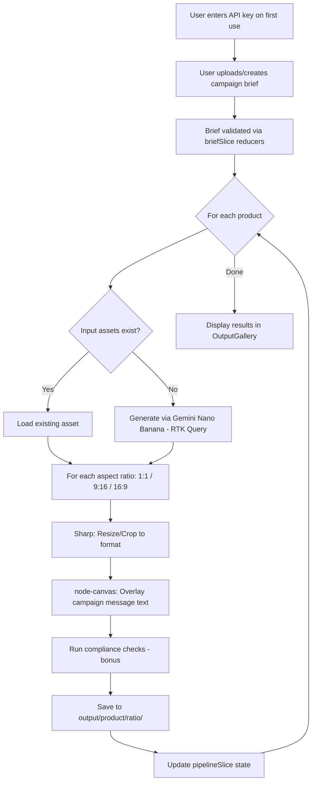

# Creative Automation Pipeline

## Summary

A production-grade MVP for automating creative asset generation across social media campaigns. Accepts structured campaign briefs, resolves or generates hero images via GenAI, produces format-specific creatives (1:1, 9:16, 16:9) with text overlays and brand compliance checks, and organizes outputs for immediate deployment.

Built for global consumer goods teams launching hundreds of localized campaigns monthly — reducing manual content creation overhead, enforcing brand consistency, and maximizing campaign velocity.

### Deliverables
1. **2–3 min demo video** of the app working
2. **Public GitHub repo** with code + comprehensive README

---

## Requirements Checklist
| # | Requirement | Notes |
|---|-------------|-------|
| 1 | Accept a **campaign brief** (JSON/YAML) with: product(s) (≥2), target region, target audience, campaign message | Input format |
| 2 | Accept **input assets** (local folder or mock storage), reuse when available | Asset management |
| 3 | Generate **new assets via GenAI** when missing | Image generation |
| 4 | Produce creatives in **≥3 aspect ratios** (1:1, 9:16, 16:9) | Social formats |
| 5 | Display **campaign message** on final posts (English min; localized = plus) | Text overlay |
| 6 | Run **locally** (CLI or simple local app) | Local execution |
| 7 | Save outputs organized by **product × aspect ratio** | Output structure |
| 8 | **README** with: how to run, example I/O, design decisions, assumptions/limitations | Documentation |
| 9 | Brand compliance checks (logo presence, brand colors) | Quality assurance |
| 10 | Legal content checks (prohibited word flagging) | Risk mitigation |
| 11 | Logging / reporting of results | Observability |
| 12 | **Multi-language localization** of campaign messages | Global reach |
| 13 | **Error handling & recovery** — graceful degradation when GenAI fails | Resilience |

### Key Clarifications (from FAQ)
- **Standard social formats**: 1:1, 9:16, 16:9
- **Create your own sample brand guidelines**
- **Multi-language**: yes
- **Success metrics**: time saved, campaigns generated, overall efficiency

---

## Tech Stack

| Layer | Choice | Rationale |
|-------|--------|-----------|
| **Framework** | Next.js (App Router) | Modern React framework; JD calls out Node.js + full-stack; supports both web UI and API routes |
| **Language** | TypeScript | Type safety, FP-aligned, JD requirement |
| **State Management** | Redux Toolkit (RTK) + RTK Query | FP maintenance strategy standard; all business logic in pure reducers |
| **GenAI API** | Gemini Nano Banana | User-specified; API key entered via UI on first use (not hardcoded) |
| **Image Processing** | node-canvas | Text overlay, compositing; may be swapped later |
| **Image Resize/Crop** | Sharp | Fast aspect ratio resizing |
| **Brief Parsing** | `js-yaml` + JSON | Support both formats |
| **UI Components** | See [UI Library Comparison](#ui-library-comparison) below |
| **Containerization** | Docker + docker-compose | Reproducible local dev; easy reviewer setup |
| **Testing** | Jest / Playwright | BDD (Given-When-Then) per FP maintenance strategy |
| **Storybook** | Full coverage | Per FP maintenance strategy |

---

## UI Library Comparison

| Criteria | **shadcn/ui** | **VengeanceUI** |
|----------|--------------|-----------------|
| **GitHub Stars** | 108k+ | Newer/smaller |
| **Component Count** | 50+ (buttons, forms, cards, tables, charts, etc.) | ~21 (animation-focused: Animated Hero, 3D Text, Glass Dock, etc.) |
| **Philosophy** | Open code — copy/paste into your project, fully customizable | Premium component library — import and use |
| **Foundation** | Radix UI primitives + Tailwind CSS | React + Next.js specific |
| **Strengths** | Comprehensive design system foundation, great for dashboards/forms, RTL support, massive ecosystem | Stunning animations (Liquid Ocean, Perspective Grid, Flip Text), visually impressive |
| **Weaknesses** | Requires Tailwind (but user didn't exclude it); less flashy out-of-box | Smaller component set; less suited for data-heavy UIs like campaign brief forms |
| **Best For This Project** | Campaign brief forms, settings UI, dashboard, data tables | Hero sections, demo wow-factor, motion design |

> [!IMPORTANT]
> **Recommendation**: Use **shadcn/ui** as the primary design system (forms, layout, data display) and selectively add **VengeanceUI** components for visual polish (animated hero, logo slider) where they add impact. This gives a complete component set while still looking premium. 

---

## Architecture

### Principles (from [FP Maintenance Strategy](file:///Users/seandinwiddie/GitHub/lectures/technology-maintenance-extensive.md))

> [!IMPORTANT]
> **Implementation Scope**: Follow the FP and presentational component patterns from the maintenance doc. **EXCLUSIONS**: Do NOT implement any Database, Expo, or Backend patterns — out of scope for this MVP.

- **Components are presentational ONLY** — zero business logic in React components
- **ALL state in Redux** — no `useState`, `useEffect`, `useCallback` for logic
- **Business logic in pure reducers** — validation, transformations, workflows
- **RTK Query for data fetching** — API calls to GenAI, asset resolution
- **Fat reducers, thin actions** — all logic centralized in reducers for time-travel debugging
- **Feature-based directory structure** — domain-driven organization
- **BDD testing** — Given-When-Then user stories written first, no mocking internal code
- **E2E tests assert data presence**, not just containers — prevent false positives on empty state
- **Full Storybook coverage** for all UI components
- **One Function Per File** — limit functions per file to enforce single responsibility and modularity

### Component Composition Hierarchy

1. **Screens** (`screens/`) — compositions of elements only, NO raw markup
2. **Unique Elements** (`elements/unique/`) — feature-specific, composed of generic elements
3. **Generic Elements** (`elements/generic/`) — design system atoms/molecules sourced **exclusively** from **shadcn/ui** or **VengeanceUI** (no custom primitives)

### UI Library Setup Instructions

#### shadcn/ui Setup ([docs](https://ui.shadcn.com/docs/installation/next))

```bash
# 1. Initialize shadcn in the Next.js project
pnpm dlx shadcn@latest init

# 2. Add components as needed (copies source into your project)
pnpm dlx shadcn@latest add button
pnpm dlx shadcn@latest add input
pnpm dlx shadcn@latest add card
pnpm dlx shadcn@latest add progress
pnpm dlx shadcn@latest add form
pnpm dlx shadcn@latest add table
pnpm dlx shadcn@latest add tabs
pnpm dlx shadcn@latest add dialog
```

Components are copied to `src/components/ui/` and are fully customizable.

```tsx
import { Button } from "@/components/ui/button"
```

#### VengeanceUI Setup ([docs](https://www.vengenceui.com/docs/installation))

```bash
# 1. Install Tailwind CSS (if not already from shadcn init)
npm install tailwindcss @tailwindcss/postcss postcss
```

Create/update `postcss.config.mjs`:
```js
export default {
  plugins: {
    "@tailwindcss/postcss": {},
  },
};
```

Add Tailwind import to `src/app/globals.css`:
```css
@import "tailwindcss";
```

```bash
# 2. Install VengeanceUI dependencies
npm install framer-motion clsx tailwind-merge lucide-react
```

Create `src/lib/utils.ts` (shared `cn` helper):
```ts
import { ClassValue, clsx } from "clsx";
import { twMerge } from "tailwind-merge";

export function cn(...inputs: ClassValue[]) {
  return twMerge(clsx(inputs));
}
```

```bash
# 3. Add VengeanceUI components via CLI
npx vengeance-ui add animated-button
npx vengeance-ui add logo-slider
npx vengeance-ui add glow-border-card
npx vengeance-ui add animated-hero

# List all available components
npx vengeance-ui list
```

> [!NOTE]
> Both libraries share the same `cn` utility and Tailwind CSS foundation, so they are fully compatible in the same project. Use **shadcn/ui** for forms, data display, and layout primitives. Use **VengeanceUI** for animation-heavy hero sections and visual polish.

### Parallel Processing (Low Latency)

To optimize integration performance and latency, the pipeline state machine (`pipelineSlice`) will orchestrate GenAI API calls and image resizing operations in parallel using `Promise.all` (via RTK Query concurrent requests) across all required aspect ratios and products simultaneously.

### Refactoring Checklist

Apply before merging any PR:
- [ ] No business logic in components
- [ ] All state in Redux (no `useState`, `useReducer`)
- [ ] All data fetching uses RTK Query
- [ ] Selectors co-located with reducers
- [ ] Files < 300 lines, preferably **one function per file**
- [ ] BDD tests exist for all reducers
- [ ] No `useEffect` for logic

### API Key Handling

> [!IMPORTANT]
> **No hardcoded API keys.** On first launch, the UI presents a settings/onboarding screen where the reviewer enters their Gemini Nano Banana API key. The key is stored in Redux state (persisted to localStorage via a listener middleware), never committed to source.

### Directory Structure

```
creative-automation-for-scalable-social-ad-campaigns/
├── Dockerfile
├── docker-compose.yml
├── README.md
├── package.json
├── tsconfig.json
├── next.config.ts
├── .env.example                          # Documents required env vars (no values)
│
├── src/
│   ├── app/                              # Next.js App Router
│   │   ├── layout.tsx                    # Root layout with Redux Provider
│   │   ├── page.tsx                      # Landing / campaign brief entry
│   │   ├── settings/
│   │   │   └── page.tsx                  # API key configuration
│   │   ├── pipeline/
│   │   │   └── page.tsx                  # Pipeline execution & progress
│   │   └── results/
│   │       └── page.tsx                  # Output gallery / download
│   │
│   ├── features/                         # Redux feature modules (domain-driven)
│   │   ├── core/
│   │   │   ├── api/
│   │   │   │   └── slice/
│   │   │   │       └── apiSlice.ts       # RTK Query base API slice
│   │   │   ├── store/
│   │   │   │   ├── store.ts              # configureStore setup
│   │   │   │   └── middleware/           # Custom middleware (persistence, logging)
│   │   │   ├── ui/
│   │   │   │   └── slice/
│   │   │   │       └── uiSlice.ts        # UI state (modals, nav, loading)
│   │   │   └── settings/
│   │   │       └── slice/
│   │   │           └── settingsSlice.ts  # API key storage, config
│   │   │
│   │   ├── brief/                        # Campaign brief domain
│   │   │   ├── slice/
│   │   │   │   └── briefSlice.ts         # Brief parsing, validation (pure reducers)
│   │   │   ├── types/
│   │   │   │   └── brief.ts              # CampaignBrief, Product types
│   │   │   └── __tests__/
│   │   │       └── briefSlice.test.ts
│   │   │
│   │   ├── assets/                       # Asset resolution & generation domain
│   │   │   ├── slice/
│   │   │   │   └── assetsSlice.ts        # Asset resolution logic (pure reducers)
│   │   │   ├── api/
│   │   │   │   └── generationApi.ts      # RTK Query: Gemini Nano Banana calls
│   │   │   ├── types/
│   │   │   └── __tests__/
│   │   │
│   │   ├── creative/                     # Creative composition domain
│   │   │   ├── slice/
│   │   │   │   └── creativeSlice.ts      # Format logic, composition state
│   │   │   ├── types/
│   │   │   │   └── formats.ts            # Aspect ratio definitions
│   │   │   └── __tests__/
│   │   │
│   │   ├── compliance/                   # Brand & legal checks (bonus)
│   │   │   ├── slice/
│   │   │   │   └── complianceSlice.ts    # Compliance rules (pure reducers)
│   │   │   └── __tests__/
│   │   │
│   │   └── pipeline/                     # Pipeline orchestration
│   │       ├── slice/
│   │       │   └── pipelineSlice.ts      # Pipeline state machine (pure reducers)
│   │       ├── listeners/
│   │       │   └── pipelineListener.ts   # Orchestration side effects
│   │       └── __tests__/
│   │
│   ├── components/                       # Presentational ONLY
│   │   ├── elements/
│   │   │   ├── generic/                  # Design system primitives (shadcn/ui)
│   │   │   │   ├── forms/               # BriefForm, APIKeyInput
│   │   │   │   ├── layout/             # AppShell, Sidebar, Grid
│   │   │   │   └── ui/                 # Button, Card, Input, Progress
│   │   │   └── unique/                  # Feature-specific components
│   │   │       ├── BriefEditor.tsx      # Campaign brief entry UI
│   │   │       ├── PipelineProgress.tsx # Execution progress display
│   │   │       ├── OutputGallery.tsx    # Generated creatives gallery
│   │   │       └── ComplianceReport.tsx # Compliance check results
│   │   └── screens/                     # Screen compositions
│   │
│   └── lib/                             # Pure utility functions
│       ├── canvas/
│       │   └── composer.ts              # node-canvas: text overlay, compositing
│       ├── image/
│       │   └── resizer.ts              # Sharp: aspect ratio resize/crop
│       └── brief/
│           └── parser.ts               # JSON/YAML brief parsing (pure function)
│
├── public/
│   └── assets/
│       └── input/                       # Pre-existing brand assets for demo
│
├── briefs/
│   └── example-brief.json              # Example campaign brief
│
├── output/                              # Generated outputs (gitignored)
│
├── stories/                             # Storybook stories
│
└── __tests__/                           # E2E / integration tests
    └── pipeline.e2e.test.ts
```

### Pipeline Flow



---

## Docker Setup

```yaml
# docker-compose.yml (outline)
services:
  app:
    build: .
    ports:
      - "3000:3000"
    volumes:
      - ./briefs:/app/briefs
      - ./output:/app/output
      - ./public/assets/input:/app/public/assets/input
    environment:
      - NODE_ENV=development
```

```dockerfile
# Dockerfile (outline)
FROM node:20-slim
# Install canvas system deps (cairo, pango, libjpeg, etc.)
RUN apt-get update && apt-get install -y build-essential libcairo2-dev ...
WORKDIR /app
COPY package*.json ./
RUN npm ci
COPY . .
RUN npm run build
CMD ["npm", "start"]
```

---

## Implementation Order

> [!IMPORTANT]
> **BDD-first**: Write all Given-When-Then scenarios as failing tests BEFORE writing any implementation code. The scenarios below define the acceptance criteria and drive all development.

---

## BDD User Stories

### Story 1: API Key Configuration

**As a** reviewer  
**I want to** enter my Gemini Nano Banana API key on first launch  
**So that** the pipeline can generate images without hardcoded credentials  

```gherkin
Feature: API Key Configuration

  Scenario: First-time user sees API key prompt
    Given the application has no stored API key
    When the user opens the application
    Then the settings screen is displayed
    And an input field for the Gemini Nano Banana API key is visible

  Scenario: User saves a valid API key
    Given the user is on the settings screen
    When the user enters a valid API key
    And the user clicks save
    Then the API key is persisted to localStorage
    And the user is redirected to the campaign brief page

  Scenario: Returning user has stored API key
    Given the application has a stored API key
    When the user opens the application
    Then the user is taken directly to the campaign brief page
```

### Story 2: Campaign Brief Input

**As a** creative team member  
**I want to** submit a campaign brief with multiple products  
**So that** the pipeline knows what creatives to generate  

```gherkin
Feature: Campaign Brief Input

  Scenario: Valid JSON brief is accepted
    Given the user has a valid campaign brief in JSON format
    And the brief contains at least two products
    And the brief includes target region, audience, and campaign message
    When the user uploads the brief
    Then the brief is parsed and validated
    And the products are displayed for confirmation

  Scenario: Valid YAML brief is accepted
    Given the user has a valid campaign brief in YAML format
    When the user uploads the brief
    Then the brief is parsed and validated

  Scenario: Invalid brief is rejected
    Given the user has a brief missing required fields
    When the user uploads the brief
    Then an error message identifies the missing fields
    And the pipeline does not start
```

### Story 3: Asset Resolution

**As a** creative team member  
**I want** existing brand assets to be reused when available  
**So that** I don't waste GenAI credits on assets I already have  

```gherkin
Feature: Asset Resolution

  Scenario: Existing asset is found and reused
    Given a product "EcoBottle" is in the campaign brief
    And an image file "ecobottle.png" exists in the input assets folder
    When the pipeline processes the "EcoBottle" product
    Then the existing image is used as the hero image
    And no GenAI call is made for this product

  Scenario: Missing asset is generated via GenAI
    Given a product "SolarCharger" is in the campaign brief
    And no matching image exists in the input assets folder
    When the pipeline processes the "SolarCharger" product
    Then a GenAI image is generated via Gemini Nano Banana
    And the generated image is saved for reuse
```

### Story 4: Creative Generation Across Aspect Ratios

**As a** creative team member  
**I want** each product's creative produced in three social media formats  
**So that** I can deploy to Instagram, Stories, and Facebook  

```gherkin
Feature: Multi-Format Creative Generation

  Scenario: Creatives are generated in all three aspect ratios
    Given a hero image exists for product "EcoBottle"
    When the pipeline generates creatives for "EcoBottle"
    Then a 1080×1080 image (1:1) is produced
    And a 1080×1920 image (9:16) is produced
    And a 1920×1080 image (16:9) is produced

  Scenario: Campaign message is overlaid on each creative
    Given the campaign message is "Stay Hydrated, Stay Green"
    When the pipeline generates a creative
    Then the campaign message text is visible on the output image
```

### Story 5: Organized Output

**As a** reviewer  
**I want** generated assets saved in a clear folder structure  
**So that** I can easily find outputs by product and format  

```gherkin
Feature: Organized Output

  Scenario: Outputs are organized by product and aspect ratio
    Given the pipeline has completed for products "EcoBottle" and "SolarCharger"
    Then the output folder contains "ecobottle/1x1/"
    And the output folder contains "ecobottle/9x16/"
    And the output folder contains "ecobottle/16x9/"
    And the output folder contains "solarcharger/1x1/"
    And the output folder contains "solarcharger/9x16/"
    And the output folder contains "solarcharger/16x9/"
```

### Story 6: Pipeline Execution & Progress (UI)

**As a** user  
**I want to** see progress as the pipeline runs  
**So that** I know it's working and how far along it is  

```gherkin
Feature: Pipeline Progress

  Scenario: Pipeline shows progress per product
    Given a valid brief with two products has been submitted
    When the pipeline is running
    Then a progress indicator shows which product is being processed
    And the overall completion percentage is displayed

  Scenario: Pipeline completes and displays success metrics
    Given the pipeline has finished all products
    Then a summary of generated assets is displayed
    And the system calculates and displays success metrics: "Estimated Time Saved", "Campaigns Generated", and "Efficiency Gain"
    And the user can browse the output gallery
```

### Story 7: Brand Compliance Check (Bonus)

```gherkin
Feature: Brand Compliance

  Scenario: Brand colors are detected in output
    Given brand colors "#00A86B" and "#FFFFFF" are configured
    When a creative is generated
    Then the compliance check reports whether brand colors are present

  Scenario: Prohibited words are flagged
    Given the prohibited word list contains "free" and "guaranteed"
    And the campaign message is "Get your free EcoBottle"
    When the compliance check runs
    Then the word "free" is flagged in the report
```

### Story 8: Error Handling & Recovery

**As a** user  
**I want** the pipeline to handle failures gracefully  
**So that** one failed product doesn't block the entire campaign  

```gherkin
Feature: Error Handling

  Scenario: GenAI API call fails for one product
    Given a valid brief with products "EcoBottle" and "SolarCharger"
    And the GenAI API returns an error for "SolarCharger"
    When the pipeline runs
    Then "EcoBottle" creatives are generated successfully
    And "SolarCharger" is marked as failed with an error message
    And the summary report shows 1 success and 1 failure

  Scenario: Invalid API key is detected
    Given the user has entered an invalid API key
    When the pipeline attempts to generate an image
    Then an authentication error is displayed
    And the user is prompted to update the API key in settings
```

### Story 9: Multi-Language Localization

**As a** global marketing team  
**I want** campaign messages translated for target regions  
**So that** creatives resonate with local audiences  

```gherkin
Feature: Localization

  Scenario: Campaign message is localized for target region
    Given the campaign message is "Stay Hydrated, Stay Green"
    And the target region is "Mexico"
    When the pipeline generates creatives
    Then the campaign message is displayed in Spanish on the output
    And the original English message is preserved in metadata
```

---

## Verification Plan

### BDD Tests
```bash
npm test                # All Given-When-Then scenarios via Jest
npx playwright test     # E2E scenarios in browser
```

### Storybook
```bash
npm run storybook       # Full component coverage
```

### Manual Verification
```bash
docker-compose up       # Start app
# Open http://localhost:3000
# 1. Enter Gemini Nano Banana API key in settings
# 2. Load example brief
# 3. Run pipeline
# 4. Verify outputs in output/<product>/<ratio>/
```

### Demo Recording
- 2–3 min walkthrough: settings → brief → pipeline execution → output gallery

---

## Debugging Strategy

Per the [FP Maintenance Strategy](file:///Users/seandinwiddie/GitHub/lectures/technology-maintenance-extensive.md#debugging-strategies):

- **Redux DevTools** for time-travel debugging, state inspection, and action history
- **redux-logger** middleware — no `console.log` or `useEffect` debugging in components
- **Systematic approach**: Reproduce → Isolate → Analyze → Fix → Write regression BDD test
- **RTK Query cache inspection** for GenAI API call debugging
